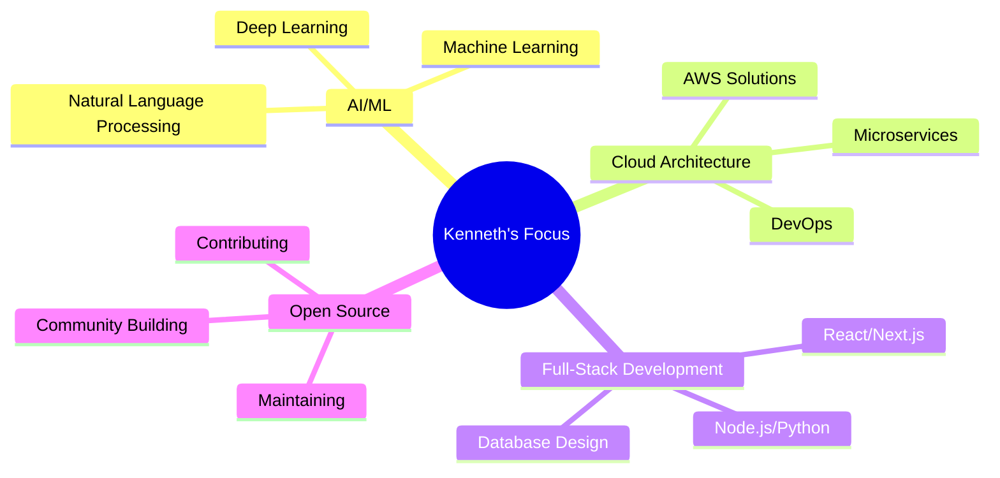

<div align="center">

<!-- Dynamic Header with Typing Animation -->


<!-- Animated Profile Picture -->


<!-- Animated Introduction -->
<h1>
  
</h1>

<!-- Dynamic Quote -->
<p>
  
</p>

<!-- Profile Views Counter -->
<p>
  
  
</p>

</div>

---

## 🚀 About Me


```typescript
class Developer {
  name: string = "Kenneth";
  role: string = "Full-Stack Developer";
  location: string = "🌍 Global Remote";
  
  languages: string[] = [
    "TypeScript", "Python", "JavaScript", 
    "Java", "Go", "Rust", "C++"
  ];
  
  frameworks: string[] = [
    "React", "Next.js", "Node.js", "Django",
    "FastAPI", "Spring Boot", "Docker"
  ];
  
  currentFocus: string = "AI/ML Integration & Cloud Architecture";
  
  getMotivation(): string {
    return "Turning coffee into code since 2020 ☕️";
  }
  
  connect(): string[] {
    return [
      "💼 Open to collaboration",
      "🎯 Always learning something new",
      "🔥 Passionate about clean code"
    ];
  }
}
```

---

## 🛠️ Tech Arsenal

<div align="center">

### 💻 Languages & Frameworks
<p>
  
</p>
<p>
  
</p>

### 🗄️ Databases & Cloud
<p>
  
</p>
<p>
  
</p>

### 🔧 Tools & Platforms
<p>
  
</p>

</div>

---

## 📊 GitHub Analytics

<div align="center">
  
  
</div>

<div align="center">
  
</div>

<!-- Activity Graph -->
<div align="center">
  
</div>

---

## 🏆 Achievements & Trophies

<div align="center">
  
</div>

---

## 🎯 Featured Projects

<div align="center">

### 🚀 Project Showcase

<table>
  <tr>
    <td width="50%">
      <h3 align="center">🤖 AI-Powered Task Manager</h3>
      <div align="center">  
        <a href="https://github.com/kenne/ai-task-manager" target="_blank">
          
        </a>
        <br>
        <p>
          
          
          
        </p>
      </div>
    </td>
    <td width="50%">
      <h3 align="center">⚡ Real-time Analytics Dashboard</h3>
      <div align="center">
        <a href="https://github.com/kenne/analytics-dashboard" target="_blank">
          
        </a>
        <br>
        <p>
          
          
          
        </p>
      </div>
    </td>
  </tr>
</table>

</div>

---

## 📈 Coding Activity

<div align="center">

### ⏰ This Week's Development Breakdown

<!--START_SECTION:waka-->
```text
TypeScript   12 hrs 30 mins  ████████████▓░░░░░░░░░░░░   50.2%
Python       8 hrs 15 mins   ████████▓░░░░░░░░░░░░░░░░   33.1%
JavaScript   3 hrs 45 mins   ███▓░░░░░░░░░░░░░░░░░░░░░   15.0%
JSON         25 mins         ▒░░░░░░░░░░░░░░░░░░░░░░░░   1.7%
```
<!--END_SECTION:waka-->

### 🔥 Current Streak: Building Every Day


</div>

---

## 🌟 What I'm Up To

<div align="center">

### 🎯 Current Focus Areas



### 📚 Learning Journey

<table align="center">
  <tr>
    <td align="center" width="96">
      
      <br>Kubernetes
    </td>
    <td align="center" width="96">
      
      <br>AWS Advanced
    </td>
    <td align="center" width="96">
      
      <br>TensorFlow
    </td>
    <td align="center" width="96">
      
      <br>GraphQL
    </td>
  </tr>
</table>

</div>

---

## 🎵 Spotify Playing

<div align="center">
  
</div>

---

## 📬 Let's Connect!

<div align="center">

### 🌐 Find Me Around the Web

<p>
  <a href="https://linkedin.com/in/kenneth-dev" target="_blank">
    
  </a>
  <a href="https://twitter.com/kenneth_codes" target="_blank">
    
  </a>
  <a href="https://kenneth.dev" target="_blank">
    
  </a>
  <a href="mailto:kenneth@example.com">
    
  </a>
</p>

### 💬 Let's Build Something Amazing Together!


</div>

---

<div align="center">

### 🐍 Watch the Snake Eat My Contributions!

<picture>
  <source media="(prefers-color-scheme: dark)" srcset="https://raw.githubusercontent.com/kenne/kenne/output/github-contribution-grid-snake-dark.svg">
  <source media="(prefers-color-scheme: light)" srcset="https://raw.githubusercontent.com/kenne/kenne/output/github-contribution-grid-snake.svg">
  
</picture>

### ⚡ Fun Fact


---


**⭐ From [Kenneth](https://github.com/kenne) - If you found this interesting, consider giving it a star!**

<!-- Visitor count -->
<p align="center">
  
</p>

</div>
